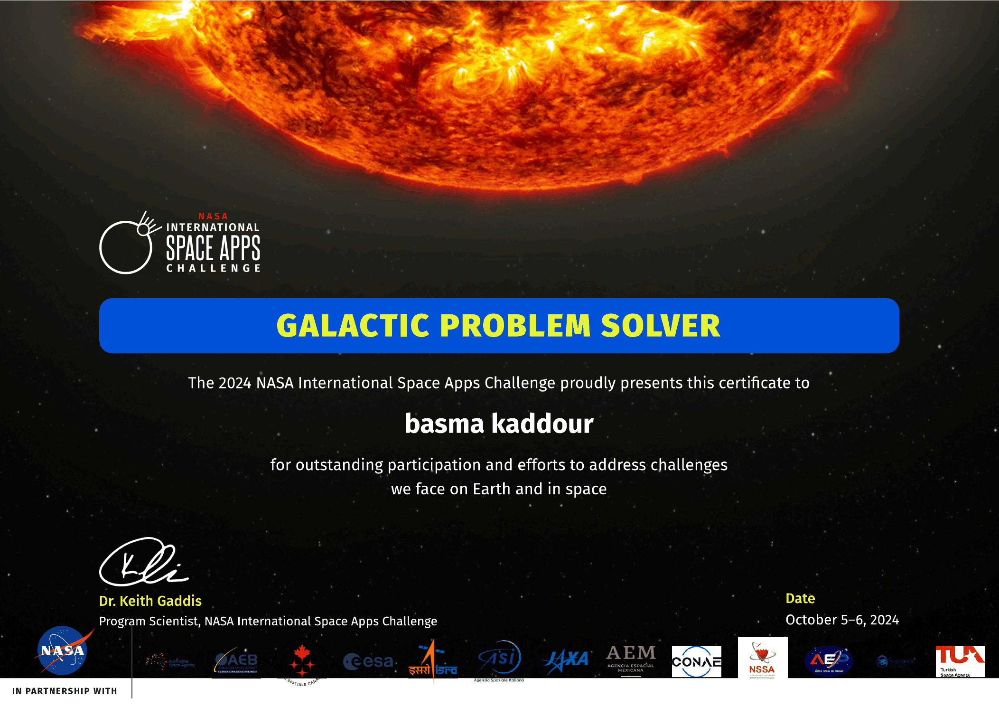

# BESMA KADDOUR

## مهندسة برمجيات Full Stack · هندسة برمجيات بمساعدة الذكاء الاصطناعي
### تطبيقات الويب والهاتف · الأنظمة البرمجية · أنظمة البيانات والبحث

**التواصل:** واتساب · البريد الإلكتروني · [LinkedIn](https://www.linkedin.com/in/beasma-kaddour-6b32312b8) · [GitHub](https://github.com/BasmaKaddour1998)

## الملف المهني

مهندسة برمجيات تعمل في تصميم تطبيقات الويب والهاتف، والأنظمة الخلفية، ولوحات المعلومات، والمنصات الرقمية، وتطبيقات الذكاء الاصطناعي والأتمتة وأنظمة البيانات والبحث. تشمل الخبرة المتطلبات والمعمارية وتنفيذ واجهات المستخدم وتطوير الواجهات الأمامية والخلفية وتصميم قواعد البيانات وواجهات REST والمصادقة والتكاملات والاختبار وتصحيح الأخطاء والنشر والصيانة وتحسين الأداء.

يُستخدم الذكاء الاصطناعي كأداة هندسية لتحليل قواعد الكود وتوليد الكود ومراجعته وتصحيح الأخطاء وإعادة الهيكلة والاختبار والتوثيق والتحقيق التقني وأتمتة التطوير، مع الحفاظ على المراجعة الهندسية والتحقق والدمج في الإنتاج.

## الخبرة الهندسية الأساسية

- هندسة Full Stack والواجهات الأمامية والخلفية.
- تطبيقات ويب متجاوبة ولوحات معلومات وواجهات API ومنصات رقمية.
- تطوير تطبيقات الهاتف وأنظمة Android وiOS متعددة المنصات.
- معمارية قواعد البيانات ونمذجة البيانات وتحسين الاستعلامات وتكامل API.
- المصادقة والتطوير المراعي للأمن.
- النشر السحابي وإعداد البيئات والصيانة في الإنتاج.
- الاختبار الآلي واختبار التكامل والانحدار والتحقق من البناء.
- تصحيح منهجي لأخطاء الشبكة والمصادقة وقواعد البيانات والهاتف والإنتاج.
- إعادة هيكلة الكود والتحكم في الإصدارات والصيانة وتحسين الأداء.

## الذكاء الاصطناعي والوكلاء والأتمتة

هندسة برمجيات بمساعدة الذكاء الاصطناعي لتحليل المعمارية وتوليد الكود ومراجعته وتصحيح الأخطاء وإعادة الهيكلة والاختبار والتوثيق وحل المشكلات والتعديلات متعددة الملفات وأتمتة التطوير. تشمل المجالات تطبيقات الذكاء الاصطناعي والواجهات الحوارية والوكلاء والأتمتة الذكية. تشمل الأدوات وأنماط العمل Claude Code وOpenCode ووكلاء البرمجة بالذكاء الاصطناعي والمراجعة والتحقق والدمج في الإنتاج.

## أنظمة البيانات والبحث

تصميم برامج وتطبيقات لمعالجة البيانات وتصويرها وبناء لوحات المعلومات ومسارات البحث وإعداد التقارير.

تشمل معمارية الأنظمة جمع البيانات والتحقق منها وتحويلها ومسارات دعم القرار والمراقبة وإعداد التقارير والتحكم في الوصول وبناء تجارب موثوقة للمستخدمين.

## الخبرة المهنية

### مهندسة برمجيات / هوية رقمية
**2024 — حتى الآن · ست سنوات من الخبرة كما وردت في الملف المقدم**

ممارسة مهنية في هندسة البرمجيات Full Stack والتطوير بمساعدة الذكاء الاصطناعي ومعمارية البرمجيات والمنتجات الرقمية وتطبيقات الهاتف والويب والمنتجات الرقمية والأتمتة والتقنية الإبداعية.

- بناء وصيانة تطبيقات الويب والهاتف والأنظمة الخلفية ولوحات المعلومات وواجهات API والمنصات الرقمية.
- العمل عبر المتطلبات والمعمارية والتنفيذ والتكامل والاختبار وتصحيح الأخطاء والنشر والصيانة.
- تطوير تطبيقات مدعومة بالذكاء الاصطناعي وأساليب هندسية عملية بمساعدته.
- تصميم برمجيات لتحليل البيانات ومسارات دعم القرار والمراقبة وإعداد التقارير وأنظمة المعلومات الموثوقة.
- فحص قواعد الكود وتنفيذ التغييرات متعددة الملفات وإعادة هيكلة الأنظمة والتحقق من سلوك الإنتاج.

## المشاريع والخبرة التقنية

أُدرجت المشاريع التالية من المعلومات المقدمة فقط، دون إضافة أسماء عملاء أو تواريخ أو روابط أو نتائج غير موثقة.

- **المنزل الذكي:** بحث وتطوير في مفاهيم المنزل المتصل والأتمتة.
- **قفل باب ذكي:** مشروع للتحكم في الدخول باستخدام بطاقة مغناطيسية.
- **تطبيق Android:** تطبيق Android منشور على Amazon.
- **الفأرات الحديثة:** مشروع متعلق بأجهزة إدخال الحاسوب.
- **نظارات للمكفوفين:** مشروع في التقنية المساعدة.
- **تطبيقات Android وiOS:** تطبيقان للهاتف لأنظمة Android وiOS.
- **تطبيقات وبرامج حاسوب:** تطوير تطبيقات وبرامج حاسوب.
- **البحث في الفيزياء والإلكترونيات:** بحث تقني وتطبيقات عملية في الإلكترونيات.
- **أنظمة البيانات والبحث:** مفاهيم برمجية لمعالجة البيانات المنظمة وتصويرها وإعداد التقارير والبحث التقني.

## المهارات والتقنيات

### لغات البرمجة
TypeScript وJavaScript وPython وJava وKotlin وPHP وHTML5 وCSS3 وArduino.

### تطوير الويب
React وNext.js والواجهات المتجاوبة ومعمارية المكونات ولوحات المعلومات وتكامل API والمصادقة والواجهات الفورية والأداء.

### تطوير البرمجيات والخلفية
Node.js وPython وPHP وLaravel وREST APIs والمصادقة ومنطق الأعمال وتكاملات API الخارجية والخدمات السحابية وبرامج الحاسوب.

### تطوير الهاتف
Flutter وReact Native وAndroid وKotlin وJava وCapacitor وتكامل iOS ومعمارية WebView والجسور الأصلية واتصال API وبناء تطبيقات الإنتاج.

### قواعد البيانات
PostgreSQL وMySQL وMongoDB وFirebase ومعمارية قواعد البيانات ونمذجة البيانات وتحسين الاستعلامات.

### السحابة والأدوات
Git وGitHub وnpm وGradle وAndroid Studio وXcode وVercel وRender وإعداد البيئات والنشر في الإنتاج.

## الاختبار وتصحيح الأخطاء والتحقق

الاختبار الآلي واختبار API والتكامل والانحدار وتصحيح مشكلات الإنتاج والبناء والشبكات والمصادقة وقواعد البيانات والهاتف والتحقق من النشر قبل الدمج في الإنتاج.

## الشهادات والتدريب

### NASA International Space Apps Challenge

**GALACTIC PROBLEM SOLVER** — شهادة مقدمة إلى **basma Kaddour** للمشاركة المتميزة في الجهود الرامية إلى معالجة التحديات التي تواجه الأرض والفضاء. **التاريخ الظاهر في الشهادة: 5–6 أكتوبر 2024.**

تشمل الدورات أو الشهادات المذكورة في الملف المقدم: **Kotlin وPython وJava وArduino**. لم تتم إضافة أسماء مؤسسات أو عناوين شهادات أو تواريخ غير متوفرة.

## التعليم والبحث

البحث في الفيزياء والإلكترونيات مذكور ضمن المعلومات المقدمة. لم تتم إضافة جامعة أو مؤسسة أو درجة أو تواريخ غير مؤكدة.

## اللغات

العربية والإنجليزية.

## الروابط المهنية

- LinkedIn: https://www.linkedin.com/in/beasma-kaddour-6b32312b8
- GitHub: https://github.com/BasmaKaddour1998
- واتساب والبريد الإلكتروني: متاحان عبر قسم التواصل في الموقع

---

© 2024–2026 BESMA KADDOUR — جميع الحقوق محفوظة
